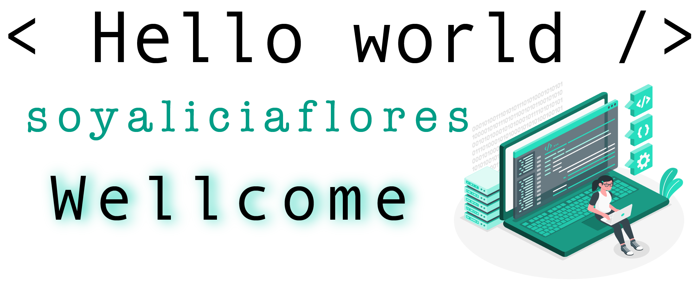

### Hi there 👋 

✨I am a web developer and communicator. I am aware that the world is changing and that I can contribute to its evolution by developing technological solutions, which is why I made the decision to learn Javascript, HTML and CSS to become a web developer. I am convinced that the best solutions are given by innovating, that is why I studied a specialty in competitiveness and sustainability. ✨

- 🔭 I’m currently studying in < Laboratoria >
- 🌱 I’m currently learning about javascript, HTML, CSS and React.

 